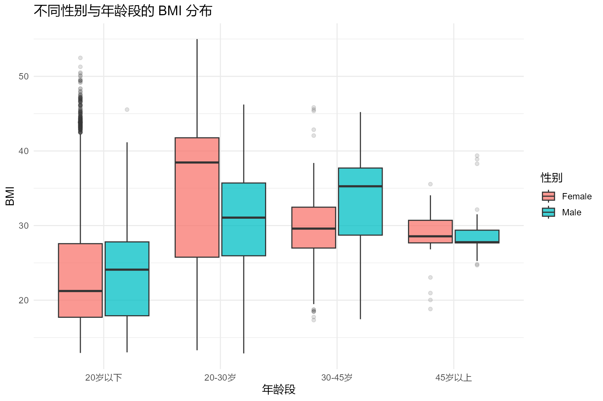
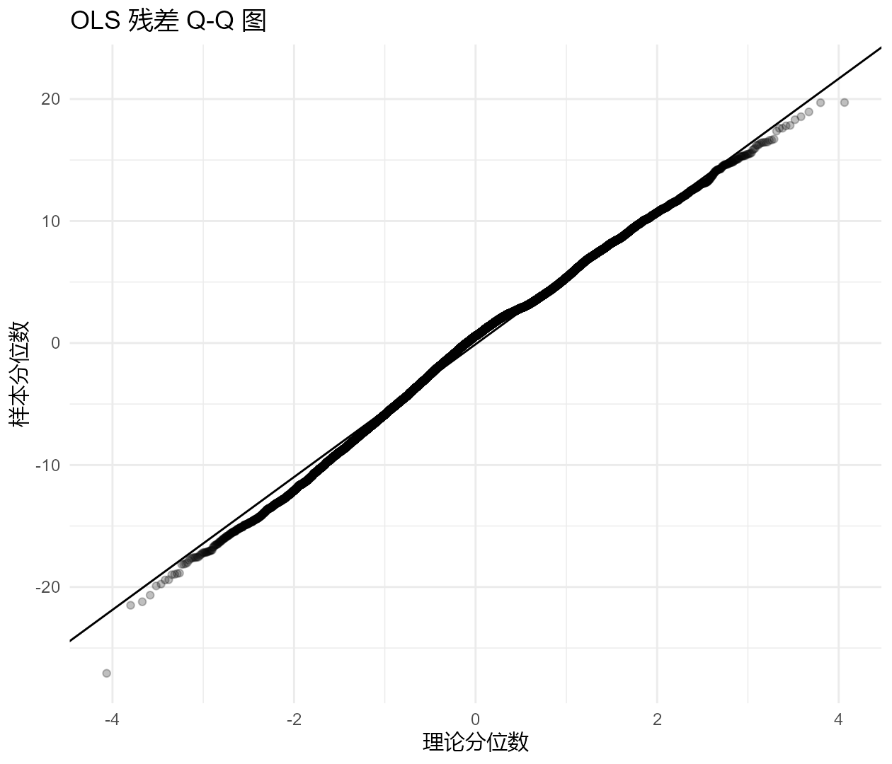
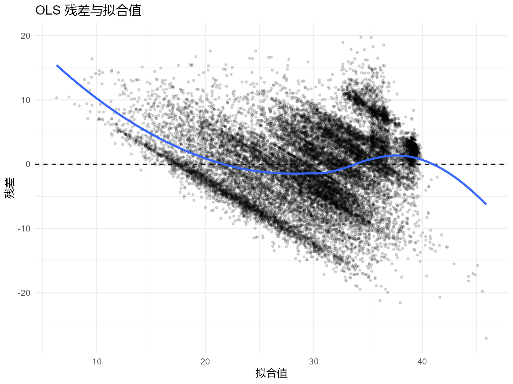
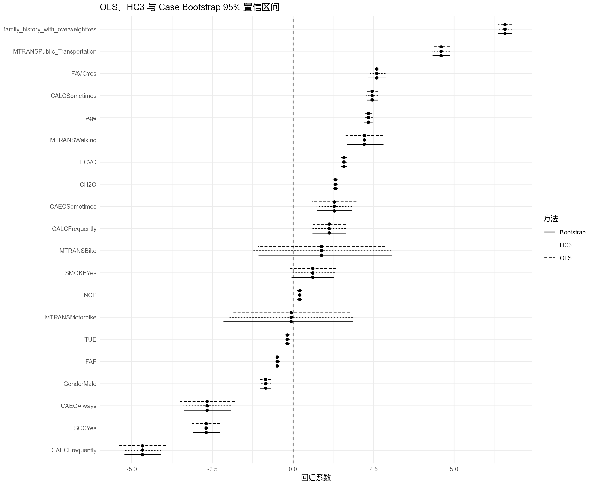

# 肥胖相关因素统计分析：非参数检验与稳健推断

## 项目简介

本项目基于肥胖相关数据，分析人口属性、生活方式因素与 BMI（Body Mass Index，身体质量指数）之间的统计关联，并重点考察在经典 OLS 假设不充分时，统计推断是否仍然稳健。

与单纯建立预测模型不同，本项目更关注完整的统计分析流程：

- 不同性别、年龄段人群的 BMI 分布是否存在显著差异；
- 饮食习惯、运动频率、家族肥胖史、交通方式等因素是否与 BMI 存在统计关联；
- 在控制年龄与性别后，部分生活方式因素是否仍能提供额外解释信息；
- 多变量 OLS 模型的正态性、同方差性和多重共线性假设是否合理；
- 当经典假设受到破坏时，HC3 稳健标准误与 Case Bootstrap 是否会改变主要推断结论。

本项目使用观察性数据，因此所有结果均解释为**统计关联**，不作因果推断，也不构成医学或健康建议。

---

## 数据来源

本项目使用的数据结构与 Kaggle **Playground Series - Season 4, Episode 2: Multi-Class Prediction of Obesity Risk** 的训练数据一致：

- 训练样本数：20,758；
- 包含 `id`、人口属性、饮食与生活方式变量；
- 原竞赛目标变量为 `NObeyesdad`（肥胖等级）。

Kaggle 说明，该竞赛训练集和测试集由一个深度学习模型生成，该模型基于原始肥胖风险数据进行训练，因此竞赛数据属于**合成生成数据**，其特征分布接近但不完全等同于原始数据。

原始数据来自 UCI Machine Learning Repository 的：

**Estimation of Obesity Levels Based On Eating Habits and Physical Condition**

该原始数据集包含 2,111 条记录，涉及墨西哥、秘鲁和哥伦比亚个体的饮食习惯与身体状况；UCI 说明其中约 77% 的记录通过 Weka/SMOTE 方法合成生成，约 23% 来自用户通过网络平台直接提供的数据。

数据来源：

- Kaggle Playground Series S4E2  
  https://www.kaggle.com/competitions/playground-series-s4e2
- UCI Machine Learning Repository  
  https://archive.ics.uci.edu/dataset/544/estimation+of+obesity+levels+based+on+eating+habits+and+physical+condition

> 为避免不必要地重新分发竞赛原始数据，本仓库默认不上传完整 CSV。复现时请从原始来源获取数据，并放置到 `data/obesity_level.csv`。

---

## 数据变量

主要变量包括：

| 变量 | 含义 |
|---|---|
| Gender | 性别 |
| Age | 年龄 |
| Height | 身高 |
| Weight | 体重 |
| family_history_with_overweight | 是否具有超重/肥胖家族史 |
| FAVC | 是否经常摄入高热量食物 |
| FCVC | 蔬菜摄入频率 |
| NCP | 每日主要进餐次数 |
| CAEC | 两餐之间进食情况 |
| SMOKE | 是否吸烟 |
| CH2O | 每日饮水情况 |
| SCC | 是否监控热量摄入 |
| FAF | 体育活动频率 |
| TUE | 电子设备使用时间 |
| CALC | 饮酒频率 |
| MTRANS | 日常交通方式 |

BMI 根据身高和体重重新计算：

\[
BMI=\frac{Weight}{Height^2}
\]

年龄划分为：

- 20 岁以下；
- 20–30 岁；
- 30–45 岁；
- 45 岁以上。

---

## 分析流程

```text
数据读取与清洗
        ↓
重新计算 BMI + 年龄分组
        ↓
描述性统计与可视化
        ↓
非参数组间比较
├─ Wilcoxon 秩和检验
├─ Kruskal-Wallis 检验
└─ Dunn 事后比较 + Bonferroni 校正
        ↓
控制年龄和性别后的秩变换分析
        ↓
多变量 OLS 回归
        ↓
OLS 模型诊断
├─ Anderson-Darling 正态性检验
├─ Breusch-Pagan 异方差检验
└─ VIF 多重共线性诊断
        ↓
HC3 异方差稳健标准误
        ↓
Case Bootstrap（B = 1000）
        ↓
OLS / HC3 / Bootstrap 置信区间与显著性比较
```

---

## 1. 描述性统计与 BMI 分布

按性别和年龄段计算样本量、BMI 均值、中位数、标准差与四分位数。

| 性别 | 年龄组 | N | BMI 均值 | BMI 中位数 |
|---|---|---:|---:|---:|
| Female | 20 岁以下 | 2754 | 24.38 | 21.23 |
| Male | 20 岁以下 | 2386 | 23.83 | 24.09 |
| Female | 20–30 岁 | 6746 | 33.91 | 38.46 |
| Male | 20–30 岁 | 5976 | 30.45 | 31.07 |
| Female | 30–45 岁 | 884 | 29.54 | 29.59 |
| Male | 30–45 岁 | 1904 | 33.52 | 35.27 |
| Female | 45 岁以上 | 38 | 28.66 | 28.56 |
| Male | 45 岁以上 | 70 | 28.62 | 27.77 |



可以看到不同年龄段的 BMI 分布存在明显差异，同时部分年龄段内部存在性别差异。

需要特别注意：45 岁以上组仅有 108 条观测，而 20–30 岁组共有 12,722 条观测，因此年龄组样本量高度不均衡。45 岁以上组的描述性结果应谨慎解释。

---

## 2. 非参数组间比较

考虑到 BMI 分布并不一定满足正态性，首先使用非参数方法比较组间差异。

### 2.1 性别差异

Wilcoxon 秩和检验结果：

\[
W=58{,}887{,}850,\qquad p=2.43\times10^{-31}
\]

结果显示，不同性别人群的 BMI 分布存在显著差异。

### 2.2 年龄组差异

Kruskal-Wallis 检验结果：

\[
H=3748.32,\qquad p<0.001
\]

说明至少两个年龄组的 BMI 分布存在显著差异。

进一步进行 Dunn 两两比较，并采用 Bonferroni 方法校正多重比较：

- 20 岁以下 vs 20–30 岁：显著；
- 20 岁以下 vs 30–45 岁：显著；
- 20 岁以下 vs 45 岁以上：显著；
- 20–30 岁 vs 30–45 岁：不显著，校正后 \(p=1.000\)；
- 20–30 岁 vs 45 岁以上：显著；
- 30–45 岁 vs 45 岁以上：显著。

结果文件：

```text
outputs/02_nonparametric_tests.csv
outputs/03_age_Dunn_Bonferroni.csv
```

---

## 3. 控制年龄与性别后的秩变换分析

为了减少 BMI 分布形态对分析的影响，同时控制年龄和性别，对 BMI 进行秩变换，并比较嵌套模型：

```text
简化模型：
BMI_rank ~ Age + Gender

完整模型：
BMI_rank ~ Age + Gender + Target_Factor
```

结果如下：

| 因素 | 自由度 | F 值 | P 值 |
|---|---:|---:|---:|
| 超重/肥胖家族史 | 1 | 5953.98 | <0.001 |
| CAEC（两餐间进食） | 3 | 1407.80 | <0.001 |
| FAVC（高热量食物摄入） | 1 | 988.87 | <0.001 |
| MTRANS（交通方式） | 4 | 495.88 | <0.001 |
| FAF（体育活动频率） | 1 | 422.58 | <0.001 |

在年龄和性别之外，上述变量均能提供显著的额外解释信息。其中，超重/肥胖家族史对应的模型增量最明显。

该部分仅用于关联分析，不作因果解释。

结果文件：

```text
outputs/04_rank_adjusted_tests.csv
```

---

## 4. 多变量 OLS 回归

建立多变量线性回归模型，以 BMI 为因变量，同时纳入人口属性、饮食、行为和交通方式变量。

连续变量：

- Age
- FCVC
- NCP
- CH2O
- FAF
- TUE

在进入模型前进行标准化，因此对应系数表示：

> 在控制其他变量不变的情况下，该变量增加 1 个样本标准差时，BMI 平均变化多少。

这与“原始变量增加 1 个单位”并不是同一含义。

模型整体拟合结果：

\[
N=20{,}758
\]

\[
R^2=0.5396
\]

\[
Adjusted\ R^2=0.5392
\]

\[
F=1215.34,\qquad p<0.001
\]

模型约解释了样本中 54% 的 BMI 变异。

结果文件：

```text
outputs/05_OLS_model_fit.csv
```

---

## 5. OLS 模型诊断

### 5.1 残差正态性

Anderson-Darling 检验：

\[
A=44.60,\qquad p=3.7\times10^{-24}
\]

统计检验拒绝残差服从正态分布的假设。



Q-Q 图显示中部残差总体较接近理论直线，但尾部存在明显偏离。

由于样本量较大，正态性检验对轻微偏离会非常敏感，因此这里同时结合图形诊断，而不是机械地只根据 P 值判断模型质量。

### 5.2 异方差

Breusch-Pagan 检验：

\[
BP=1654.31,\qquad p<0.001
\]

表明模型存在明显异方差。



残差并未完全随机地围绕 0 分布，LOESS 平滑曲线还呈现明显结构。这提示模型问题可能不仅包括异方差，也可能包含一定的非线性结构或函数形式设定不足。

因此，传统 OLS 标准误不应作为唯一的推断依据。

### 5.3 多重共线性

模型使用 GVIF 检查多重共线性。所有变量的调整后 GVIF 均较低，其中最大值约为：

\[
GVIF^{1/(2Df)}=1.40
\]

未发现严重的多重共线性问题。

结果文件：

```text
outputs/06_model_diagnostics.csv
outputs/07_VIF.csv
```

---

## 6. HC3 异方差稳健标准误

考虑到 Breusch-Pagan 检验和残差图均提示异方差，本项目进一步采用 HC3 协方差估计器重新计算：

- 稳健标准误；
- P 值；
- 95% 置信区间。

HC3 不改变 OLS 系数的点估计，而是修正其方差估计，从而检验主要结论是否过度依赖经典同方差假设。

部分代表性结果如下：

| 因素 | 系数估计 | HC3 95% CI | 方向 |
|---|---:|---:|---|
| 超重/肥胖家族史：Yes | +6.58 | [6.37, 6.80] | 正相关 |
| 公共交通 | +4.60 | [4.32, 4.87] | 正相关 |
| FAVC：Yes | +2.60 | [2.33, 2.87] | 正相关 |
| CALC：Sometimes | +2.46 | [2.28, 2.64] | 正相关 |
| Age（标准化） | +2.34 | [2.21, 2.47] | 正相关 |
| Walking | +2.21 | [1.63, 2.80] | 正相关 |
| FCVC（标准化） | +1.58 | [1.50, 1.67] | 正相关 |
| CH2O（标准化） | +1.31 | [1.24, 1.39] | 正相关 |
| SCC：Yes | -2.70 | [-3.13, -2.27] | 负相关 |
| CAEC：Frequently | -4.67 | [-5.25, -4.08] | 负相关 |
| FAF（标准化） | -0.49 | [-0.58, -0.40] | 负相关 |

这些系数表示控制模型中其他变量后的**条件统计关联**，不能解释为因果效应。

例如，“公共交通”系数为正并不意味着乘坐公共交通会导致 BMI 上升；它也可能反映未测量混杂、样本选择、生活环境或其他变量的共同作用。

结果文件：

```text
outputs/08_OLS_vs_HC3.csv
```

---

## 7. Case Bootstrap 稳健性分析

为了进一步降低推断对参数分布假设的依赖，对完整观测行进行有放回抽样：

1. 每次从原始样本中有放回抽取 \(N\) 条记录；
2. 在 Bootstrap 样本上重新拟合完整模型；
3. 重复 1000 次；
4. 根据系数经验分布计算 95% 置信区间。

设置：

```r
SEED <- 42
BOOT_B <- 1000
```

所有回归项均获得 1000 次有效 Bootstrap 估计。

Case Bootstrap 不要求所有残差具有相同方差结构，但仍依赖观测之间近似独立，因此该部分同样用于**稳健性验证**，而不是因果识别。

---

## 8. OLS、HC3 与 Bootstrap 比较



本项目共比较 20 个非截距回归项。

| 方法 | 显著项数量 |
|---|---:|
| 传统 OLS | 17 |
| HC3 | 17 |
| Case Bootstrap | 17 |

更重要的是：

\[
20/20
\]

个回归项在三种方法下获得了完全相同的“显著 / 不显著”分类。

三种方法下均未达到 0.05 显著性水平的变量为：

- SMOKE：Yes；
- MTRANS：Bike；
- MTRANS：Motorbike。

例如 SMOKE：

\[
\hat\beta=0.617
\]

HC3 95% CI：

\[
[-0.060,\ 1.294]
\]

Bootstrap 95% CI：

\[
[-0.042,\ 1.269]
\]

两种区间均跨越 0，因此没有足够证据表明吸烟状态在控制其他变量后与 BMI 存在稳定的独立统计关联。

总体而言：

> 虽然经典 OLS 的正态性和同方差假设并不理想，但主要回归推断并未明显依赖传统标准误估计方法；HC3 与 Case Bootstrap 对主要显著性结论提供了较一致的稳健性验证。

结果文件：

```text
outputs/09_interval_comparison.csv
outputs/10_robustness_summary.csv
```

---

## 9. 结果解释中的注意事项

### 9.1 统计关联不等于因果效应

本项目使用观察性/合成数据，没有随机实验设计，因此所有回归系数都只能解释为条件关联。

### 9.2 分类变量系数依赖参考组

例如 CAEC、CALC 和 MTRANS 的系数均表示相对于其参考类别的差异，不能简单拼接成“剂量—反应”或单调趋势。

### 9.3 大样本下 P 值需要结合效应量解释

样本量达到 20,758 后，即使较小效应也可能获得很小的 P 值。因此，本项目同时报告：

- 回归系数；
- 95% 置信区间；
- 模型诊断；
- 多种稳健推断方法的一致性。

### 9.4 线性模型仍可能存在函数形式不足

残差—拟合值图存在明显结构。HC3 可以改善异方差条件下的标准误估计，但不能修复遗漏非线性项、交互项或其他模型设定错误。

---

## 项目结构

```text
obesity-risk-analysis/
│
├── data/
│   └── README.md
│
├── src/
│   └── analysis.R
│
├── outputs/
│   ├── 01_BMI_group_summary.csv
│   ├── 01_BMI_性别年龄段分布.png
│   ├── 02_nonparametric_tests.csv
│   ├── 02_OLS_residual_QQ.png
│   ├── 03_age_Dunn_Bonferroni.csv
│   ├── 03_OLS_residual_vs_fitted.png
│   ├── 04_rank_adjusted_tests.csv
│   ├── 04_置信区间稳健性比较.png
│   ├── 05_OLS_model_fit.csv
│   ├── 06_model_diagnostics.csv
│   ├── 07_VIF.csv
│   ├── 08_OLS_vs_HC3.csv
│   ├── 09_interval_comparison.csv
│   ├── 10_robustness_summary.csv
│   └── sessionInfo.txt
│
├── report/
├── README.md
├── .gitignore
└── LICENSE
```

---

## 环境与依赖

本项目在 R 4.3.2、Windows 11 环境下完成。

主要依赖：

```r
install.packages(c(
  "ggplot2",
  "dplyr",
  "tidyr",
  "rstatix",
  "nortest",
  "lmtest",
  "sandwich",
  "car"
))
```

| R 包 | 主要用途 |
|---|---|
| ggplot2 | 数据可视化 |
| dplyr | 数据处理 |
| tidyr | 数据整理 |
| rstatix | Dunn 等统计检验 |
| nortest | Anderson-Darling 正态性检验 |
| lmtest | Breusch-Pagan 检验 |
| sandwich | HC3 稳健协方差估计 |
| car | VIF / GVIF 多重共线性诊断 |

完整软件包版本记录在：

```text
outputs/sessionInfo.txt
```

---

## 复现方法

### 1. 获取数据

从上述数据来源获取相应训练数据，并将需要分析的 CSV 保存为：

```text
data/obesity_level.csv
```

### 2. 安装依赖

```r
install.packages(c(
  "ggplot2",
  "dplyr",
  "tidyr",
  "rstatix",
  "nortest",
  "lmtest",
  "sandwich",
  "car"
))
```

### 3. 运行完整分析

在项目根目录执行：

```r
source("src/analysis.R")
```

脚本会自动创建或更新 `outputs/` 目录，并生成统计表格、模型诊断图和稳健性比较结果。

---

## 项目特点

本项目重点展示的是完整统计推断流程，而不是单纯堆叠模型：

```text
数据探索
    ↓
非参数检验
    ↓
协变量调整
    ↓
多变量建模
    ↓
模型假设诊断
    ↓
发现异方差与分布问题
    ↓
HC3 稳健标准误
    ↓
Case Bootstrap
    ↓
比较不同推断方法的一致性
```

主要体现：

- R 数据处理与可视化；
- 非参数统计方法；
- 多变量线性回归；
- 模型假设诊断；
- 异方差稳健推断；
- Bootstrap 重抽样；
- 对“统计显著”与“因果解释”的区分；
- 可复现分析流程设计。

---

## 局限性与后续方向

当前分析仍存在以下限制：

1. 数据具有合成生成成分，并不等同于随机抽取的真实总体样本；
2. 各年龄组样本量高度不均衡；
3. OLS 残差图提示可能存在非线性结构；
4. HC3 可以改善异方差条件下的标准误估计，但不能修复模型函数形式错误；
5. Bootstrap 可以验证推断稳定性，但不能消除未观测混杂；
6. 本项目以连续 BMI 为主要分析对象，没有直接建立肥胖等级分类模型。

后续可进一步探索：

- Restricted Cubic Splines；
- 广义加性模型（GAM）；
- 非线性交互效应；
- 稳健回归；
- 对肥胖等级进行多分类建模；
- 比较统计推断模型与机器学习预测模型的目标差异。

---

## 免责声明

本项目仅用于统计方法实践、数据分析学习及个人作品展示。

结果仅代表该数据集中的统计关联，不构成医学、营养或健康建议。

---

## License

本项目代码采用 MIT License。

数据本身不由本项目作者原创，其使用和再分发应遵循原始数据来源的许可或竞赛条款。
